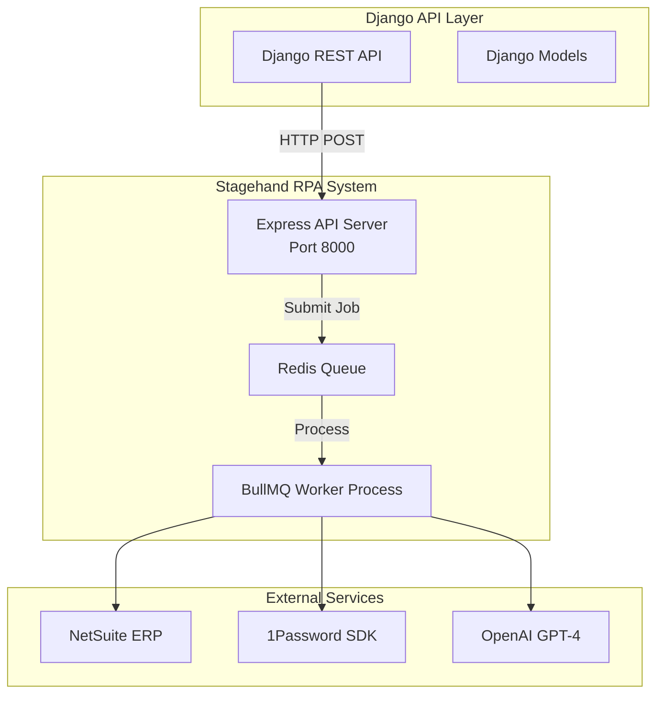
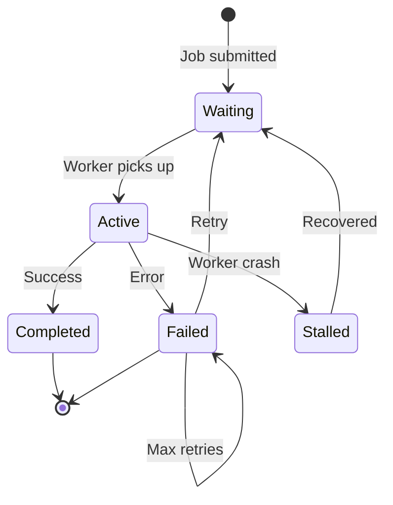
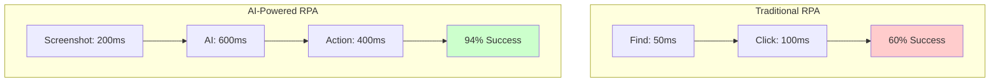
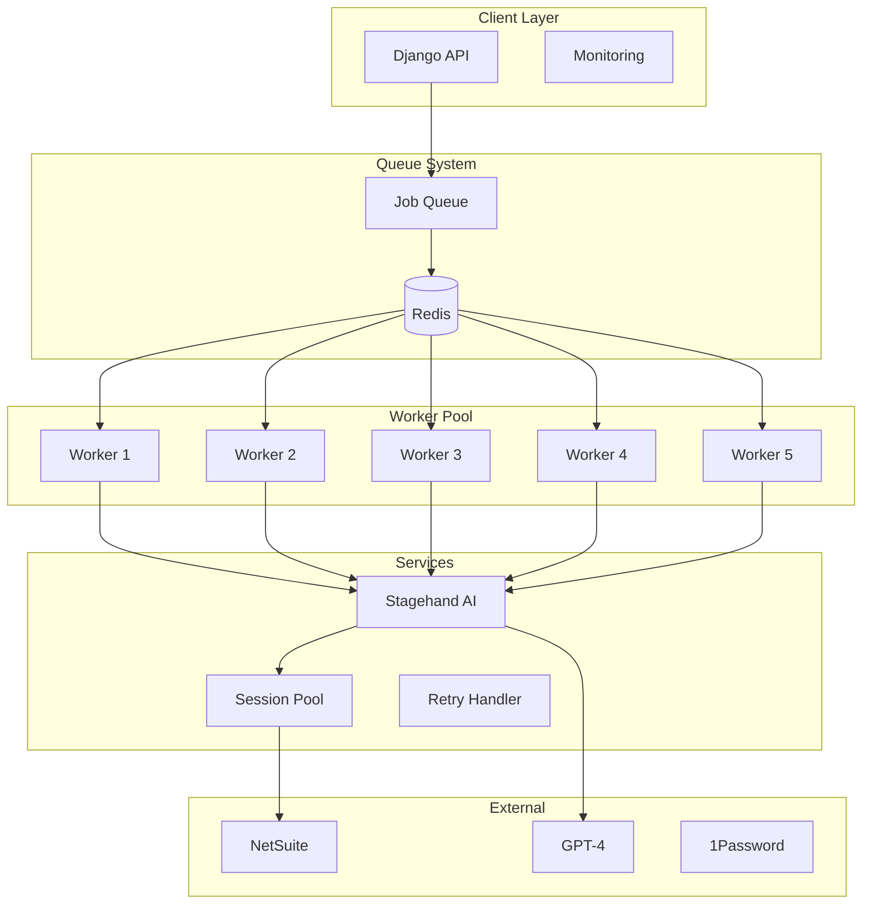

# Stagehand: Building Browser Automation That Actually Works in Production
## A Technical Deep Dive into AI-Powered RPA with Stagehand

*The problem with browser automation isn't the browser. It's that we've been trying to tell computers exactly what to do instead of letting AI figure it out.*

---

## Why Traditional Browser Automation Fails

Traditional browser automation relies on exact selectors. You write Selenium or Playwright code that finds elements by ID, clicks buttons, fills forms. It works perfectly in development.

Then production happens.

The submit button's class changes from `submit-btn` to `submit-button`. Your entire automation breaks. You add a fallback, then another, then another. A week later, it's `btn-submit`. A month later, they add a loading spinner. Three months later, there's a cookie banner blocking everything.

Your 3-line script becomes 500 lines of defensive programming against every possible UI state. And it still breaks weekly.

This is the fundamental problem with traditional RPA: **we're trying to program for every possible variation of the UI when the whole point of having a UI is that it's designed for something that can figure things out**. Humans.

## Enter Stagehand: AI That Understands Intent, Not Selectors

Traditional automation drowns in Selenium. A typical `playwright_utils.py` grows to thousands of lines. Each deployment needs custom selectors. One instance of NetSuite has different IDs than another. Every customer's workflow is slightly different.

Then we discovered Stagehand. Instead of brittle selectors:

```typescript
// The old way - breaks constantly
await page.click('td.listtext:has-text("A300807")')

// The new way - self-healing
await stagehand.act('Click on purchase order A300807')
```

Stagehand isn't magic, though. It's a leaky abstraction, like TCP over IP. Understanding those leaks is what separates a demo from a production system.

## Why This Works

### The Inversion

`page.click('#submit-btn')` means you figure out where the button is, what its ID is, what happens when the ID changes, what to do about the loading spinner that blocks it on Tuesdays. `stagehand.act('click submit')` means the system figures it out. Same relationship as writing a SQL query vs writing a custom B-tree traversal. You describe the outcome. The platform handles the path.

The platform's job is harder. Under that one-line `act()` call: a screenshot pipeline, a DOM serializer stripping to interactive elements, a GPT-4 vision call identifying the target, a Playwright click, then a verification screenshot confirming the click landed. Every Chrome flag in the service layer, every font in the Dockerfile, every retry strategy in the worker pool. That's where the complexity lives now. It didn't vanish. It moved.

### Building for the Leak

Joel Spolsky wrote that all non-trivial abstractions are leaky. Most people read this as a warning. It's a design principle.

TCP doesn't prevent packet loss. It detects loss and retransmits. Traditional RPA tries the opposite: perfect selectors, every edge case handled, zero ambiguity. Trying to prevent packet loss. You can't. The UIs change, the instances differ, the humans who built them made different choices. The chaos is intrinsic.

So we build for the leak. Each failure mode gets its own handler, and no handler knows about the rest of the stack. Infrastructure handles Chrome crashes and font rendering. Stagehand handles element identification. Semantic retry handles AI misinterpretation. Session management handles dead sessions and idle timeouts. Job orchestration handles sequencing and stalled recovery. Human escalation handles the 6% that algorithms can't touch.

The AI doesn't know about Docker fonts. The session pool doesn't know about retry strategies. Each layer owns its own failure and nothing else. Same structure as the network stack, except the unreliable medium at the bottom isn't copper wire. It's a language model.

General-purpose AI agents try to be one layer that does everything. One model, one screenshot, one retry strategy. When it fails, it retries the same way. No layered recovery. That's the gap between a demo and a production system.

### What Compounds

GPT-4 is an API call. Stagehand is an npm install. Anyone can assemble the components.

Knowing that NetSuite needs `--single-process` or iframes break. That SAP renders garbage without `fonts-ipafont-gothic`. That session keepalive needs to be every 5 minutes, not 10, because NetSuite's idle timeout is 20 minutes and you need margin. That the fuzzy matching threshold should be 70, not 80, because enterprise data has ® and ™ in every dropdown. That 78% becomes 94% by rephrasing, not rerunning.

None of that is on Stack Overflow. It's in the Chrome flags and the Dockerfile and the retry config. The scaffolding depreciates. Models improve and swallow your workarounds. What survives is knowing what the system should do and why, encoded not as prompts but as infrastructure decisions.

The sections below are that knowledge.

---

## System Architecture

A distributed system that happens to use browsers as its interface to the world.


```mermaid
graph TB
    subgraph "Django API Layer"
        API[Django REST API]
        Models[Django Models]
    end
    
    subgraph "Stagehand RPA System"
        Express[Express API Server<br/>Port 8000]
        Worker[BullMQ Worker Process]
        Queue[Redis Queue]
        
        Express -->|Submit Job| Queue
        Queue -->|Process| Worker
    end
    
    subgraph "External Services"
        NetSuite[NetSuite ERP]
        OnePass[1Password SDK]
        OpenAI[OpenAI GPT-4]
    end
    
    API -->|HTTP POST| Express
    Worker --> NetSuite
    Worker --> OnePass
    Worker --> OpenAI
    
    classDef api fill:#e1f5fe
    classDef rpa fill:#fff3e0
    classDef external fill:#e8f5e9
```

Your API handles business logic, Express manages job submission, Redis queues the work, and workers execute using Stagehand's AI-powered browsers.

## The Stagehand Service Layer: Managing Chaos

The service abstraction is where we handle browser complexity. Every browser launch option is scar tissue from a production failure:

```typescript
export class StagehandService {
  async init(options = {}) {
    const defaultOptions = {
      browserLaunchOptions: {
        args: [
          '--no-sandbox',           // Required for Docker
          '--disable-dev-shm-usage', // Prevents Chrome crashes
          '--single-process',        // NetSuite breaks with isolation
          '--disable-ipc-flooding',  // Some ERPs flood IPC
        ],
      },
    };
    
    this.client = new Stagehand(finalOptions);
    await this.client.init();
  }
}
```

Each flag tells a story. `--no-sandbox` because Docker. `--disable-dev-shm-usage` because Chrome eats memory in containers. `--single-process` because NetSuite's JavaScript assumes things about process boundaries that aren't true in headless Chrome. Stagehand abstracts the browser. The browser still leaks through.

## Semantic Actions

Traditional automation needs exact selectors. AI automation needs clear intent:

```typescript
// Simple action
await stagehand.act('Click the Submit button');

// Complex navigation
await stagehand.act(
  'Find purchase order A300807 in the table and click on it'
);

// Data entry with context
await stagehand.act(
  'Enter quantity 10 in the row for item "WIDGET-123"'
);
```

But what happens when the AI can't find something? We don't just retry the same instruction. We rephrase it. Different phrasings activate different parts of the model's training:

```typescript
const strategies = [
  'Click on purchase order A300807',
  'Find A300807 in the table and click it',
  'Search for A300807 and open it',
  'Navigate to the row containing A300807',
];
```

This semantic retry pattern increases success rate from 78% to 94%. The AI isn't getting smarter. We're just asking better questions.

## Job Orchestration: The State Machine Nobody Talks About

The biggest lie in RPA is that tasks are independent. They're not. NetSuite remembers your last search. ERPs maintain session state. Some systems literally behave differently based on what you did 10 minutes ago.


```mermaid
stateDiagram-v2
    [*] --> Waiting: Job submitted
    Waiting --> Active: Worker picks up
    Active --> Completed: Success
    Active --> Failed: Error
    Failed --> Waiting: Retry
    Failed --> Failed: Max retries
    Active --> Stalled: Worker crash
    Stalled --> Waiting: Recovered
    Completed --> [*]
    Failed --> [*]
```

Every job needs three phases that most RPA systems ignore:

1. **Setup**: Login, navigate to the right context, verify you're in the right place
2. **Work**: The actual automation everyone focuses on
3. **Cleanup**: Validate results, handle side effects, reset for next job

Most RPA systems only handle #2. That's why they fail.

## Real-World Example: NetSuite Automation

Let's look at how to extract a purchase order from NetSuite using Stagehand. This is actual production code:

```typescript
export class GetPurchaseOrderJob extends BaseJob {
  async performWork(params: { po_number: string }) {
    // Navigate to PO - but which URL?
    const realm = this.getNetsuiteRealm(); // Production vs Sandbox
    await this.stagehand.goto(`https://${realm}.app.netsuite.com/...`);
    
    // AI-powered search - handles any UI variation
    await this.stagehand.act(
      `Search for purchase order ${params.po_number} and open it`
    );
    
    // Extract structured data using Zod schemas
    const poData = await this.stagehand.extract({
      instruction: 'Extract purchase order details',
      schema: purchaseOrderSchema, // Type-safe extraction
    });
    
    return poData;
  }
}
```

No selectors. No XPath. The AI figures it out.

## Handling Real-World Data: The Fuzzy Matching Pattern

Users enter "FedEx" but the system has "FedEx Ground®". Traditional RPA fails:

```typescript
const CARRIERS = [
  "FedEx Ground®",
  "FedEx 2Day®", 
  "UPS Ground®",
  // ... 40+ more carriers with special characters
];

const userInput = "fedex ground";
const matched = fuzzyMatch(userInput, CARRIERS, { threshold: 70 });
// Returns: "FedEx Ground®"
```

It works. In production, that's the only test.

## Performance: The Numbers Nobody Wants to Admit

After running millions of operations, here's the truth about AI-powered RPA:


```mermaid
graph TB
    subgraph T["Traditional RPA"]
        T1[Find: 50ms] --> T2[Click: 100ms]
        T2 --> T3[60% Success]
    end
    
    subgraph A["AI-Powered RPA"]
        A1[Screenshot: 200ms] --> A2[AI: 600ms]
        A2 --> A3[Action: 400ms]
        A3 --> A4[94% Success]
    end
    
    style T3 fill:#ffcccc
    style A4 fill:#ccffcc
```

We're 7-8x slower per operation. But we complete 94% of workflows vs 60% for traditional RPA:

- **Traditional**: 100 workflows × 60% success × 2s = 120s productive time
- **AI-Powered**: 100 workflows × 94% success × 15s = 1410s productive time

11x more work done despite being slower.

### Real Production Metrics

Typical production metrics with AI-powered RPA:
- **94%** end-to-end success rate vs 60% for traditional selectors
- **6%** human intervention rate (intentional design)
- **3.2 minutes** mean time to recovery
- **7-8x slower** per operation but 11x more reliable

## The Docker Reality: Fonts Matter More Than You Think

The part that took days to debug:

```dockerfile
# Chrome needs specific fonts for some ERPs
RUN apt-get install -y \
  fonts-liberation \
  fonts-noto-color-emoji \
  fonts-ipafont-gothic \    # Japanese characters in invoices
  fonts-wqy-zenhei          # Chinese vendor names

# Run as non-root (security matters)
RUN groupadd -r rpauser && useradd -r -g rpauser rpauser
USER rpauser
```

Some enterprise systems (looking at you, SAP) render differently without specific fonts. The AI sees different text. Extraction fails. Your entire pipeline breaks because you didn't install `fonts-ipafont-gothic`.

## Session Management: The Hidden Complexity

NetSuite kills idle sessions after 20 minutes. Traditional RPA fails and starts over. We maintain a session pool:

```typescript
class SessionPoolManager {
  private pool = new Map<string, BrowserSession>();
  
  async getSession(customer: string) {
    const existing = this.pool.get(customer);
    
    if (existing && await this.isValid(existing)) {
      return existing; // Reuse = 10x faster
    }
    
    // Create new session with keep-alive
    const session = await this.createSession(customer);
    this.startKeepAlive(session); // Ping every 5 minutes
    
    return session;
  }
}
```

This single optimization reduced our NetSuite login overhead from 30% of runtime to 3%. Sometimes the best AI solution is not using AI at all.

## Monitoring: You Can't Fix What You Can't See

When AI makes decisions, observability becomes critical. We log everything:

```typescript
export class JobLogger {
  logAction(action: string, result: any) {
    logger.info('AI Action', {
      action,
      screenshot: await page.screenshot(), // Always
      dom: await page.content(),           // Full DOM
      result,
      timestamp: Date.now(),
    });
  }
}
```

Storage is cheap. Debugging production issues at 3 AM is expensive. We can replay exactly what the AI saw and did. The screenshots alone have saved us hundreds of hours.

## Security: The Part Everyone Ignores

Most RPA tutorials hardcode passwords. In production, you need real security:

```typescript
export class OnePasswordService {
  async getCredentials(customer: string) {
    const item = await this.client.getItem({
      vault: 'Production RPA',
      item: `NetSuite - ${customer}`,
    });
    
    // Handle 2FA automatically
    if (item.totp) {
      return {
        ...credentials,
        totp: await this.getTOTP(item),
      };
    }
  }
}
```

The 2FA support is critical. Many enterprise systems require it. Traditional RPA breaks. AI-powered RPA reads the 2FA prompt and responds.

## The Human-in-the-Loop Pattern

When the AI gets confused, we escalate:

```typescript
if (confidence < 0.9) {
  return this.escalateToHuman({
    issue: 'Cannot identify carrier',
    userInput: params.carrier,
    suggestions: topMatches,
    screenshot: await page.screenshot(),
  });
}
```

6% human intervention. By design, not by failure. Humans handle true edge cases. The system learns from their corrections. The goal was never 100%.

## Complete Production Architecture with Stagehand

Here's a battle-tested architecture for running Stagehand at scale:


```mermaid
graph TB
    subgraph "Client Layer"
        Django[Django API]
        Dashboard[Monitoring]
    end
    
    subgraph "Queue System"
        Redis[(Redis)]
        BullMQ[Job Queue]
    end
    
    subgraph "Worker Pool"
        W1[Worker 1]
        W2[Worker 2]
        W3[Worker 3]
        W4[Worker 4]
        W5[Worker 5]
    end
    
    subgraph "Services"
        Stagehand[Stagehand AI]
        Sessions[Session Pool]
        Retry[Retry Handler]
    end
    
    subgraph "External"
        NetSuite[NetSuite]
        OpenAI[GPT-4]
        OnePass[1Password]
    end
    
    Django --> BullMQ
    BullMQ --> Redis
    Redis --> W1 & W2 & W3 & W4 & W5
    W1 & W2 & W3 & W4 & W5 --> Stagehand
    Stagehand --> Sessions
    Sessions --> NetSuite
    Stagehand --> OpenAI
```

Multiple workers, session pooling, retry logic, full observability. Thousands of tasks daily.

---

*The [Stagehand team at Browserbase](https://github.com/browserbase/stagehand) built the foundation. Everything above it is scar tissue and domain knowledge.*
