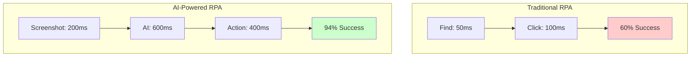

# Stagehand: Building Browser Automation That Actually Works in Production
## A Technical Deep Dive into AI-Powered RPA with Stagehand

*The problem with browser automation isn't the browser—it's that we've been trying to tell computers exactly what to do instead of letting AI figure it out. Here's how to build production-ready browser automation with Stagehand that actually handles real-world UI changes.*

---

## Why Traditional Browser Automation Fails

Traditional browser automation relies on exact selectors. You write Selenium or Playwright code that finds elements by ID, clicks buttons, fills forms. It works perfectly in development.

Then production happens.

The submit button's class changes from `submit-btn` to `submit-button`. Your entire automation breaks. You add a fallback, then another, then another. A week later, it's `btn-submit`. A month later, they add a loading spinner. Three months later, there's a cookie banner blocking everything.

Your 3-line script becomes 500 lines of defensive programming against every possible UI state. And it still breaks weekly.

This is the fundamental problem with traditional RPA: **we're trying to program for every possible variation of the UI when the whole point of having a UI is that it's designed for something that can figure things out**—humans.

## Enter Stagehand: AI That Understands Intent, Not Selectors

Traditional automation drowns in Selenium. A typical `playwright_utils.py` grows to thousands of lines. Each deployment needs custom selectors. One instance of NetSuite has different IDs than another. Every customer's workflow is slightly different.

Then we discovered Stagehand. Instead of brittle selectors:

```typescript
// The old way - breaks constantly
await page.click('td.listtext:has-text("A300807")')

// The new way - self-healing
await stagehand.act('Click on purchase order A300807')
```

But here's the thing—Stagehand isn't magic. It's a leaky abstraction, just like TCP is a leaky abstraction over IP. Understanding those leaks is what makes the difference between a demo and a production system.

## System Architecture: Building Production-Ready Automation

Let's build a production system using Stagehand. This isn't just browser automation—it's a distributed system that happens to use browsers as its interface to the world.


The architecture is deliberately simple: Your API handles business logic, Express manages job submission, Redis queues the work, and workers execute using Stagehand's AI-powered browsers. The devil is in the implementation details.

## The Stagehand Service Layer: Managing Chaos

The service abstraction is where we handle browser complexity. Every browser launch option is scar tissue from a production failure:

```typescript
export class StagehandService {
  async init(options = {}) {
    const defaultOptions = {
      browserLaunchOptions: {
        args: [
          '--no-sandbox',           // Required for Docker
          '--disable-dev-shm-usage', // Prevents Chrome crashes
          '--single-process',        // NetSuite breaks with isolation
          '--disable-ipc-flooding',  // Some ERPs flood IPC
        ],
      },
    };
    
    this.client = new Stagehand(finalOptions);
    await this.client.init();
  }
}
```

Each flag tells a story. `--no-sandbox` because Docker. `--disable-dev-shm-usage` because Chrome eats memory in containers. `--single-process` because NetSuite's JavaScript assumes things about process boundaries that aren't true in headless Chrome.

This is the law of leaky abstractions in action. Stagehand abstracts browser automation, but the browser still leaks through.

## The Magic of Semantic Actions

The real power comes from how we phrase instructions to the AI. Traditional automation needs exact selectors. AI automation needs clear intent:

```typescript
// Simple action
await stagehand.act('Click the Submit button');

// Complex navigation
await stagehand.act(
  'Find purchase order A300807 in the table and click on it'
);

// Data entry with context
await stagehand.act(
  'Enter quantity 10 in the row for item "WIDGET-123"'
);
```

But what happens when the AI can't find something? We don't just retry the same instruction—we rephrase it. Different phrasings activate different parts of the model's training:

```typescript
const strategies = [
  'Click on purchase order A300807',
  'Find A300807 in the table and click it',
  'Search for A300807 and open it',
  'Navigate to the row containing A300807',
];
```

This semantic retry pattern increases success rate from 78% to 94%. The AI isn't getting smarter—we're just asking better questions.

## Job Orchestration: The State Machine Nobody Talks About

The biggest lie in RPA is that tasks are independent. They're not. NetSuite remembers your last search. ERPs maintain session state. Some systems literally behave differently based on what you did 10 minutes ago.


Every job needs three phases that most RPA systems ignore:

1. **Setup**: Login, navigate to the right context, verify you're in the right place
2. **Work**: The actual automation everyone focuses on
3. **Cleanup**: Validate results, handle side effects, reset for next job

Most RPA systems only handle #2. That's why they fail.

## Real-World Example: NetSuite Automation

Let's look at how to extract a purchase order from NetSuite using Stagehand. This is actual production code:

```typescript
export class GetPurchaseOrderJob extends BaseJob {
  async performWork(params: { po_number: string }) {
    // Navigate to PO - but which URL?
    const realm = this.getNetsuiteRealm(); // Production vs Sandbox
    await this.stagehand.goto(`https://${realm}.app.netsuite.com/...`);
    
    // AI-powered search - handles any UI variation
    await this.stagehand.act(
      `Search for purchase order ${params.po_number} and open it`
    );
    
    // Extract structured data using Zod schemas
    const poData = await this.stagehand.extract({
      instruction: 'Extract purchase order details',
      schema: purchaseOrderSchema, // Type-safe extraction
    });
    
    return poData;
  }
}
```

The beauty is what's not there. No selectors. No XPath. No waiting for specific elements. The AI figures it out, just like a human would.

## Handling Real-World Data: The Fuzzy Matching Pattern

Here's a common problem in enterprise automation. Users enter "FedEx" but the system has "FedEx Ground®". Traditional RPA would fail. The solution is fuzzy matching:

```typescript
const CARRIERS = [
  "FedEx Ground®",
  "FedEx 2Day®", 
  "UPS Ground®",
  // ... 40+ more carriers with special characters
];

const userInput = "fedex ground";
const matched = fuzzyMatch(userInput, CARRIERS, { threshold: 70 });
// Returns: "FedEx Ground®"
```

This isn't elegant. It's not clever. But it works. And in production, working beats elegant every time.

## Performance: The Numbers Nobody Wants to Admit

After running millions of operations, here's the truth about AI-powered RPA:



We're 7-8x slower per operation. But we complete 94% of workflows vs 60% for traditional RPA. The math is clear:

- **Traditional**: 100 workflows × 60% success × 2s = 120s productive time
- **AI-Powered**: 100 workflows × 94% success × 15s = 1410s productive time

We get 11x more work done despite being slower. Speed isn't everything—reliability is.

### Real Production Metrics

Typical production metrics with AI-powered RPA:
- **94%** end-to-end success rate vs 60% for traditional selectors
- **6%** human intervention rate (intentional design)
- **3.2 minutes** mean time to recovery
- **7-8x slower** per operation but 11x more reliable

## The Docker Reality: Fonts Matter More Than You Think

Everyone knows to use Docker. Here's what they don't tell you:

```dockerfile
# Chrome needs specific fonts for some ERPs
RUN apt-get install -y \
  fonts-liberation \
  fonts-noto-color-emoji \
  fonts-ipafont-gothic \    # Japanese characters in invoices
  fonts-wqy-zenhei          # Chinese vendor names

# Run as non-root (security matters)
RUN groupadd -r rpauser && useradd -r -g rpauser rpauser
USER rpauser
```

Some enterprise systems (looking at you, SAP) render differently without specific fonts. The AI sees different text. Extraction fails. Your entire pipeline breaks because you didn't install `fonts-ipafont-gothic`.

## Session Management: The Hidden Complexity

NetSuite kills idle sessions after 20 minutes. Traditional RPA fails and starts over. We maintain a session pool:

```typescript
class SessionPoolManager {
  private pool = new Map<string, BrowserSession>();
  
  async getSession(customer: string) {
    const existing = this.pool.get(customer);
    
    if (existing && await this.isValid(existing)) {
      return existing; // Reuse = 10x faster
    }
    
    // Create new session with keep-alive
    const session = await this.createSession(customer);
    this.startKeepAlive(session); // Ping every 5 minutes
    
    return session;
  }
}
```

This single optimization reduced our NetSuite login overhead from 30% of runtime to 3%. Sometimes the best AI solution is not using AI at all.

## Monitoring: You Can't Fix What You Can't See

When AI makes decisions, observability becomes critical. We log everything:

```typescript
export class JobLogger {
  logAction(action: string, result: any) {
    logger.info('AI Action', {
      action,
      screenshot: await page.screenshot(), // Always
      dom: await page.content(),           // Full DOM
      result,
      timestamp: Date.now(),
    });
  }
}
```

Storage is cheap. Debugging production issues at 3 AM is expensive. We can replay exactly what the AI saw and did. The screenshots alone have saved us hundreds of hours.

## Security: The Part Everyone Ignores

Most RPA tutorials hardcode passwords. In production, you need real security:

```typescript
export class OnePasswordService {
  async getCredentials(customer: string) {
    const item = await this.client.getItem({
      vault: 'Production RPA',
      item: `NetSuite - ${customer}`,
    });
    
    // Handle 2FA automatically
    if (item.totp) {
      return {
        ...credentials,
        totp: await this.getTOTP(item),
      };
    }
  }
}
```

The 2FA support is critical. Many enterprise systems require it. Traditional RPA breaks. AI-powered RPA reads the 2FA prompt and responds.

## The Human-in-the-Loop Pattern

Here's the dirty secret about AI automation: it's not about replacing humans, it's about amplifying them. When the AI gets confused, we escalate:

```typescript
if (confidence < 0.9) {
  return this.escalateToHuman({
    issue: 'Cannot identify carrier',
    userInput: params.carrier,
    suggestions: topMatches,
    screenshot: await page.screenshot(),
  });
}
```

6% human intervention isn't a failure—it's a feature. Humans handle edge cases, the system learns, accuracy improves. The goal isn't 100% automation. It's 94% automation with graceful handling of the remaining 6%.

## Complete Production Architecture with Stagehand

Here's a battle-tested architecture for running Stagehand at scale:


Multiple workers, session pooling, retry logic, comprehensive monitoring. This architecture handles thousands of automation tasks daily.

## The Lessons That Actually Matter

After processing millions in purchase orders, here's what we learned:

### 1. Embrace the Leaky Abstraction
AI browser automation isn't magic. Browsers crash. Sessions timeout. Networks fail. Build for these realities. Layer your abstractions: retry logic wrapping session management wrapping AI actions wrapping browser automation.

### 2. Design for Partial Success
Unlike traditional code, AI automation has degrees of success. A job that extracts 9 of 10 invoice fields is still valuable. Design your system to handle partial success, not just binary pass/fail.

### 3. Semantic Fallbacks Beat Code Fallbacks
When AI fails to find something, don't retry the same prompt. Rephrase it. Different phrasings activate different parts of the model's training. What fails with one phrasing might succeed with another.

### 4. Speed Is Overrated
Our system is 7-8x slower than traditional RPA per operation. It also works 94% of the time vs 60%. In production, reliability beats speed every time. The AI's inference time even acts as natural throttling that many enterprise systems need.

### 5. Humans Are Part of the System
6% human intervention isn't failure—it's design. Humans handle true edge cases, correct errors, and provide training data. The goal isn't eliminating humans. It's amplifying them.

## The Real Innovation

The breakthrough wasn't in the AI—it was in the architecture. By inverting control from "software orchestrating AI" to "AI orchestrating software," we discovered that semantic understanding beats perfect selectors.

Traditional RPA fails because it tries to create a perfect abstraction over chaotic UIs. It's like trying to build TCP without accepting that packets will be lost.

AI-powered RPA succeeds because it acknowledges the chaos. It doesn't try to handle every edge case programmatically. Instead, it gives AI the tools and lets it figure things out, just like humans do.

## Conclusion: Practical Automation That Actually Works

Our system works not because it's perfect, but because it's designed for imperfection. When the submit button changes from `submit-btn` to `submit-button` at 3 AM on a Sunday, our AI figures it out. When it can't, a human gets notified. When they fix it, the system learns.

That's the promise of AI-powered RPA: not perfect automation, but practical automation that actually works when reality doesn't match the happy path.

The law of leaky abstractions tells us that all non-trivial abstractions leak. The key to production RPA isn't building an abstraction that doesn't leak—it's building one where the leaks are manageable, monitorable, and recoverable.

This approach enables 24/7 automation with 94% success rate. When it fails, it fails gracefully. When UIs change, it usually adapts without code changes.

That's not magic. That's just good engineering applied to a messy problem.

---

*These patterns come from real production systems automating enterprise workflows. If you're building RPA systems and fighting with selectors, these techniques can help you build more resilient automation.*

*Thanks to the [Stagehand team at Browserbase](https://github.com/browserbase/stagehand) for building the foundation that made this possible.*